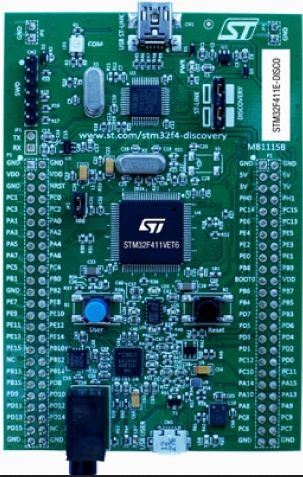
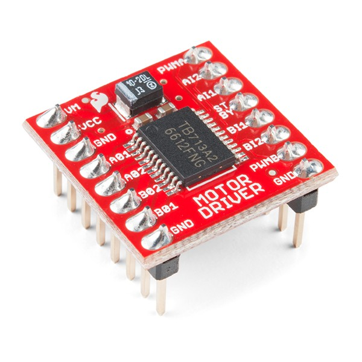
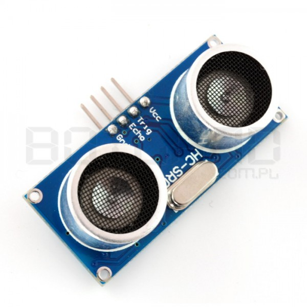
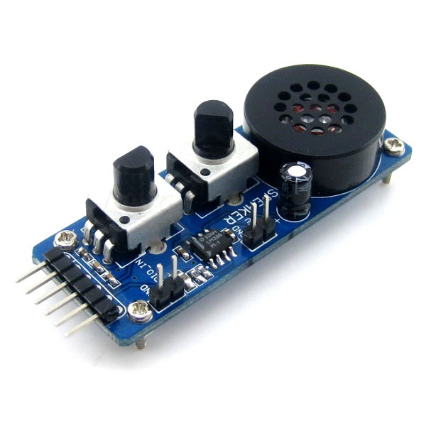
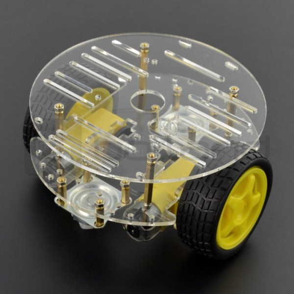
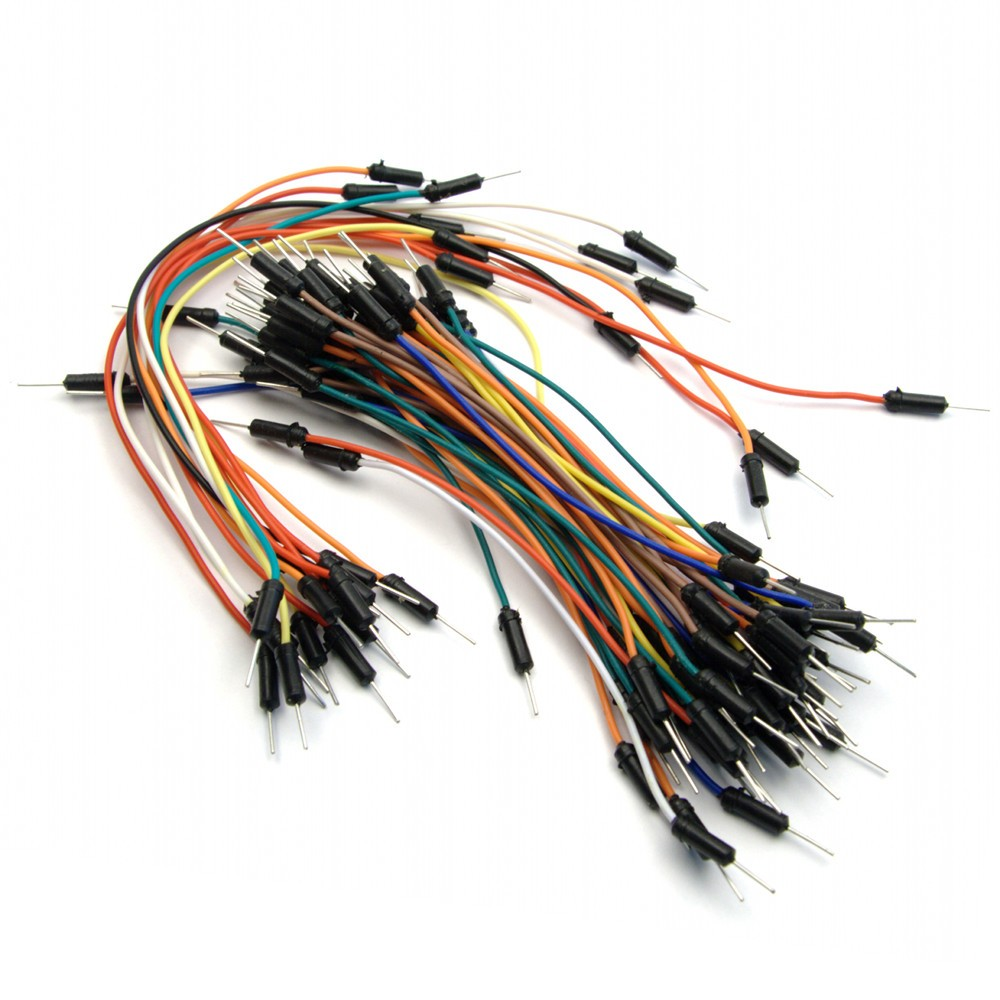
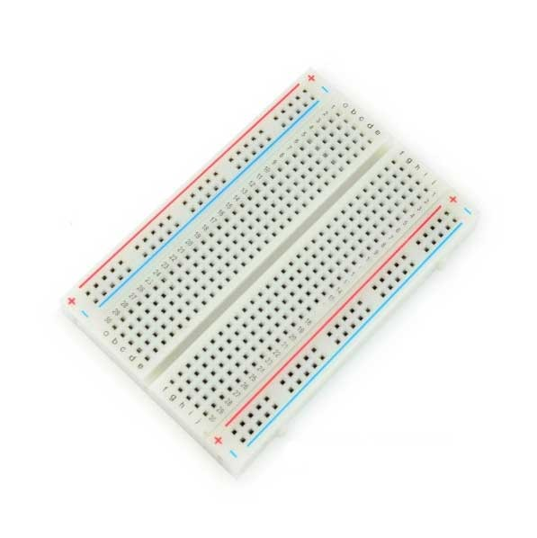
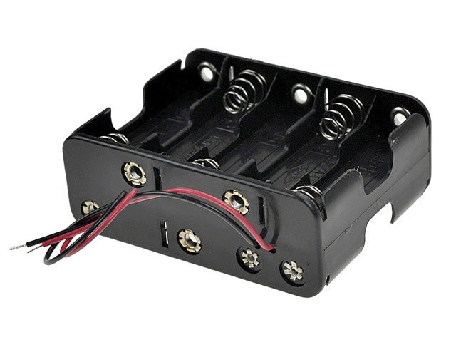
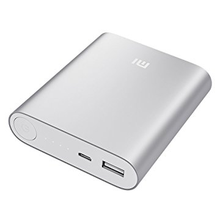
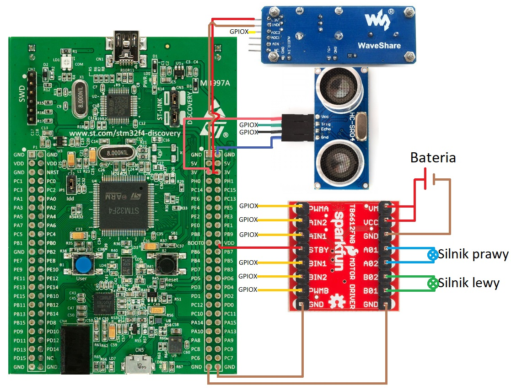

# Robot unikający przeszkód

## Ostrzeżenia
1) Uważaj podczas pracy z wysokim napięciem! Występuje ryzyko porażenia!

# Cel projektu
Zaprezentowany projekt robota ma na celu unikanie przeszkód. Pojazd jedzie automatycznie przed siebie, a gdy napotka na drodze przeszkodzę, zmienia kierunek jazdy, aby jej uniknąć.

## Opis projektu
Na mikrokontroler STM32F411 zostały skompilowany program w jęzku C, który steruje pojazdem. Silnikami steruje moduł SparkFun TB6612FNG, a za wykrywanie przeszkód odpowiedzialny jest ultradźwiękowy czujnik odległości HC-SR04 2-200cm. Szybkość pojazdu jest dostosowywana przy pomocy układu ADC LM386M.

## Narzędzia
### Potrzebne elementy
STM32F411 
   
Dwukanałowy sterownik silników SparkFun TB6612FNG  
  
Ultradźwiękowy czujnik odległości HC-SR04 2-200cm  
  
Moduł z głośnikiem do testowania przetworników A/C i C/A - LM386M  
  
Chassis Round 2WD - 2-kołowe podwozie robota z napędem  
  
Kabelki    
  
Płytka prototypowa  
  
Koszyczek na 4 baterie AA  
  
4 baterie AA  
  

### Dodatkowe elementy
Powerbank do zasilania płytki STM32F411  
  

## Jak uruchomić
### Podłączenie	

### Uwaga! GPIOX to dowolny port GPIO

|TB6612FNG |   STM32  |
|----------|----------|
|   PWMA   |  GPIOB4  |
|   AIN2   |  GPIOC2  |
|   AIN1   |  GPIOC1  |
|   STBY   |  VCC 3V  |
|   BIN1   |  GPIOC3  |
|   BIN2   |  GPIOC4  |
|   PWMB   |  GPIOA5  |
|   GND    |   GND    |

  

| HC-SR04 | STM32 |
|---------|---------|
|   VCC   |  VCC 3V |
|   Trig   |   GPIOD12   |
|   Echo   |   GPIOD1  |
|   GND   |   GND  |

| LM386M | STM32 |
|--------|-------|
|  3.3V  | VCC 3V |
|  GND   |  GND  |
|  ADC2  | GPIOA1 |

### Kompilacja
Kod dla STM32: Program main.c należy skompilować przy użyciu np. System Workbench for STM32.

### Użycie
1) Włożyć baterie do koszyczka
2) Podłączyć naładowany powerbank do płytki STM32F411
3) Ustawić żądaną prędkość pojazdu przy pomocy potencjometru modułu ADC

### Obrazy zawarte w tym pliku
STM32F411: [st.com][ext0]  
Dwukanałowy sterownik silników SparkFun TB6612FNG: [botland.com.pl][ext1]  
Ultradźwiękowy czujnik odległości HC-SR04 2-200cm: [botland.com.pl][ext2]  
Moduł z głośnikiem do testowania przetworników A/C i C/A - LM386M: [botland.com.pl][ext3]  
Chassis Round 2WD - 2-kołowe podwozie robota z napędem: [botland.com.pl][ext4]  
Kabelki:  [electropark.pl][ext5]  
Płytka prototypowa:[technovade.pl][ext6]  
Koszyczek na 4 baterie AA: [inelsc.pl][ext7]  
4 baterie AA: [euro.com.pl][ext8]  
Powerbank do zasilania płytki STM32F411: [mi.com][ext9]  

## Autorzy
Piotr Kontowicz  
piotr.kontowicz@student.put.poznan.pl  
  
Damian Szkudlarek 
damian.t.szkudlarek@student.put.poznan.pl

<!--LINKS-->
[ext0]: http://www.st.com/en/evaluation-tools/32f411ediscovery.html
[ext1]: https://botland.com.pl/sterowniki-silnikow-moduly/10666-sparkfun-tb6612fng-dwukanalowy-sterownik-silnikow-15v12a-ze-zlaczami.html
[ext2]: https://botland.com.pl/ultradzwiekowe-czujniki-odleglosci/1420-ultradzwiekowy-czujnik-odleglosci-hc-sr04-2-200cm.html
[ext3]: https://botland.com.pl/przetworniki-ac-i-ca/4489-95inch-rgb-oled-a-ic-test-board.html
[ext4]: https://botland.com.pl/podwozia-robotow/7243-chassis-round-2wd-2-kolowe-podwozie-robota-z-napedem.html
[ext5]: http://electropark.pl/arduino/4844-arduino-uno-r3-mega-starter-kit.html
[ext6]: http://technovade.pl/plytka-stykowa-prototypowa-400-otworow.html
[ext7]: https://inelsc.pl/pl/p/Koszyk-na-baterie-R6-10xAA-dwustronny-na-zatrzask-G310/4404
[ext8]: https://www.euro.com.pl/baterie/energizer-aa-base-plus-4-szt-.bhtml
[ext9]: http://www.mi.com/in/pb10400/
